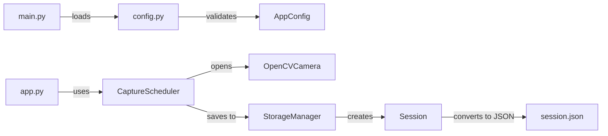

# AI Coding Agent Instructions for PiTimeLapse Lab

## 🎬 Project Overview

**PiTimeLapse Lab** is a cross-platform Flask web application for capturing time-lapse photos using USB/built-in cameras (OpenCV) or Raspberry Pi cameras (picamera2). The default and recommended mode is **OpenCV** for maximum cross-platform compatibility.

### Key Goals
- Beginner-friendly (extensive inline documentation)
- **OpenCV as primary mode** (works on Windows/macOS/Linux/Raspberry Pi)
- Graceful handling of optional hardware/libraries
- Web-based control with status reporting
- Pi Camera support for advanced Raspberry Pi users

---

## 🏗️ Architecture & Data Flow

```
User Browser (Web UI)
    ↓
Flask App (app.py) - Routes HTTP requests
    ↓
CaptureScheduler (capture.py) - Background thread manages capture loop
    ├→ Opens camera (camera_opencv.py or camera_picamera2.py)
    ├→ Captures frames at interval_seconds
    ├→ Saves to StorageManager → disk (storage.py)
    ├→ Tracks Session metadata (models.py)
    └→ Reports Status back to web UI
    ↓
Config (config.yaml) + AppConfig (config.py)
```

### Critical Components

| File | Purpose | Key Classes |
|------|---------|------------|
| `app.py` | Flask routes + web templates | Various route handlers |
| `capture.py` | Background capture engine | `CaptureScheduler` |
| `config.py` | Settings validation & loading | `AppConfig` dataclass |
| `storage.py` | File organization, session metadata | `StorageManager` |
| `camera_opencv.py` | USB webcam capture | `OpenCVCamera` |
| `camera_picamera2.py` | Pi Camera Module capture | `PiCamera2Camera` |
| `models.py` | Data structures | `Session`, `Status`, `Config` |
| `main.py` | CLI entry point | Command handlers |

---

## 🎯 Critical Patterns & Conventions

### 1. **Optional Dependency Handling**
Always wrap optional imports, check availability, and provide fallback behavior:
```python
try:
    import cv2
    OPENCV_AVAILABLE = True
except ImportError:
    OPENCV_AVAILABLE = False
    cv2 = None
    logger.warning("Install with: pip install opencv-python-headless")

# Later, always check before using:
if not OPENCV_AVAILABLE:
    return False
```
- **Why**: Some libraries (picamera2) only work on Raspberry Pi
- **Location**: `camera_opencv.py`, `camera_picamera2.py`, `config.py`

### 2. **Configuration Validation Pattern**
Use `AppConfig.validate()` to return list of errors (not exceptions):
```python
errors = config.validate()
if errors:
    for error in errors:
        logger.error(f"  - {error}")
    return 1  # Exit with error code
```
- **Why**: Allows the CLI `validate` command to show all issues at once
- **Location**: `config.py` (main validation), `main.py` (validation command)

### 3. **Thread-Safe Status Reporting**
The `CaptureScheduler` runs in background thread. Status updates use locks:
```python
with self._lock:
    self.status.total_photos = new_count
    self._notify_status_change()  # Callback to web UI
```
- **Why**: Web UI polls status while capture thread is running
- **Location**: `capture.py`

### 4. **Session Metadata Persistence**
Each session folder gets a `session.json` with metadata. Services are to be saved on every photo:
```python
self.storage.save_session_metadata(self.current_session)  # Called after each capture
```
- **Why**: Allows app restart without losing progress
- **Location**: `storage.py`, `capture.py`

### 5. **Camera Abstraction Interface**
Both camera implementations follow same interface:
```python
camera.is_available() → bool
camera.open(width, height) → bool
camera.capture() → np.ndarray or None
camera.close() → None
```
- **Why**: Easy to add new camera types (e.g., gstreamer, IP cameras)
- **Location**: `camera_opencv.py`, `camera_picamera2.py`

---

## 🔧 Developer Workflows

### Running & Testing
```bash
# Validate everything before running
python main.py validate  # Checks config, packages, camera, permissions

# Start web server (default)
python main.py
python main.py --debug   # Auto-reload on code changes

# List sessions
python main.py sessions

# Cleanup old sessions
python main.py cleanup --days 7

# Run tests
pytest tests/ -v
pytest tests/test_config.py::TestAppConfig::test_validate_valid_config
```

### Common Edit Tasks

**Adding a new configuration option:**
1. Add field to `AppConfig` dataclass in `config.py` with docstring
2. Add validation rule in `AppConfig.validate()`
3. Document in `config.yaml` comments
4. Create test in `tests/test_config.py`

**Adding a new camera type:**
1. Create `camera_newtype.py` with class following interface
2. Add optional import handling
3. Update `capture.py` to recognize mode in `_open_camera()`
4. Test with `python main.py validate`

**Fixing error messages:**
- OpenCV stderr is suppressed in `camera_opencv.py` line ~85 (os.dup2 redirection)
- User-facing messages go to logger → `main.py` displays them
- Test validation messages in `tests/test_config.py`

---

## 📋 Important Implementation Details

### Background Capture Loop (`capture.py`)
- Runs in dedicated thread (safety: uses `threading.Event` for signaling)
- Captures on interval, retries 3x on failure
- Respects duration limit and storage limit
- Saves session.json after each capture for recovery

### Error Handling Philosophy
- **Camera errors**: Log warning, return False, web UI shows user
- **Disk errors**: Log error, add to session.errors list, stop capture
- **Config errors**: Show all errors at once, prevent startup
- Never crash silently - always log with context

### Validation Command (`main.py`)
The `validate` command performs 4 comprehensive checks:
1. Configuration syntax and value ranges
2. Required packages installed (`_check_packages`)
3. Camera opens and captures test frame (`_check_camera`)
4. Storage directory has write permissions (`_check_storage`)
- See `main.py` lines 116-286 for implementation

---

## 🚨 Common Issues & Solutions

| Issue | Root Cause | Fix |
|-------|-----------|-----|
| Camera subprocess stderr noise | OpenCV spams to stderr | Use `os.dup2(2, /dev/null)` (see `camera_opencv.py:88`) |
| Config not reloading | Static global in `app.py` | Call `init_app()` to reinitialize |
| Photos not saving | Capture thread not calling `save_session_metadata` | Add callback after `_capture_one_image()` |
| PEP 668 install errors on Pi | Python protected environment | Use `pip install --break-system-packages` (documented in `06_installation_guide.md`) |

---

## 📚 Key Interdependencies



**Update Steps When Modifying:**
- Change `AppConfig` fields → update `config.yaml` comments + `test_config.py`
- Change `Session` fields → update `storage.py` load/save logic + session.json structure
- Change capture interval logic → test with `python main.py validate` + manual capture test
- Add logger calls → ensure they use module-level `logger = logging.getLogger(__name__)`

---

## 📖 Documentation Location

- **Installation**: `docs/06_installation_guide.md` (platform-specific steps)
- **Configuration**: `docs/07_configuration_guide.md` (all config options)
- **CLI/API**: `docs/09_cli_api_reference.md` (commands and endpoints)
- **Troubleshooting**: `docs/08_troubleshooting.md` (diagnostic steps, emphasizes `validate`)
- **Code comments**: Extensive inline docstrings in every module

---

## ✅ Quality Checklist Before Committing

- [ ] `python main.py validate` passes on test system
- [ ] Camera tests pass: `pytest tests/ -k camera` or manual verify
- [ ] Configuration changes tested with both valid and invalid inputs
- [ ] Logging added for new error paths
- [ ] Background thread safety reviewed (locks used for shared state)
- [ ] Session metadata saved on state changes
- [ ] Error messages are user-facing and actionable
- [ ] Optional dependencies gracefully handled
