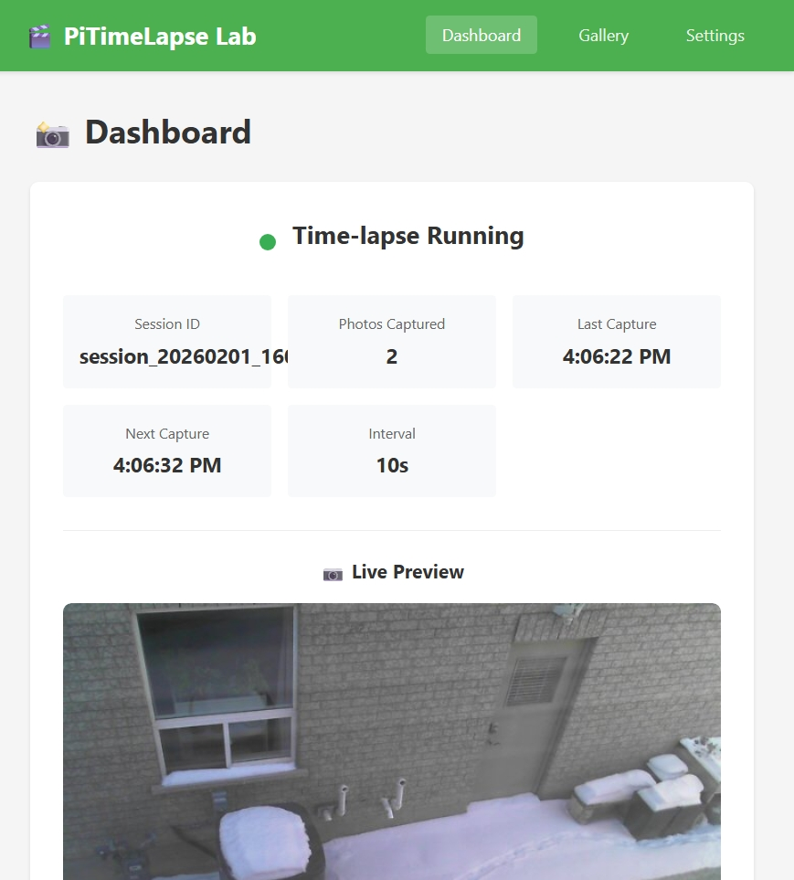
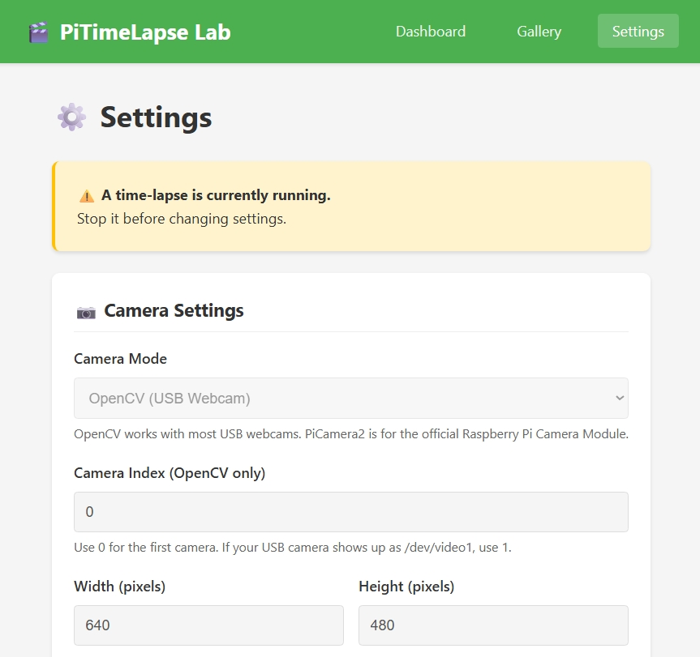

# 🌐 Scenario 01 — WebApp TimeLapse

A **web-based time-lapse application** built with Flask and OpenCV. Control your camera from any browser — on your phone, laptop, or another computer on the network.

> 📖 Part of [PiTimeLapse Lab](../README.md). See also: [Scenario 02 — Touch TimeLapse](../02%20-%20Touch%20TimeLapse/README.md)

---

## ✨ Features

- 📸 **Capture photos** on a configurable schedule (1–3600 seconds)
- 📷 **Works with** USB webcams (recommended), built-in cameras, or Pi Camera Module
- 💻 **Cross-platform:** Windows, macOS, Linux, Raspberry Pi
- 🌐 **Web interface** — start/stop captures, view gallery, change settings
- ⏰ **Timestamp overlay** on every image
- 📦 **Download sessions** as ZIP files
- 🖥️ **CLI tools** — validate setup, list sessions, cleanup old data
- 🧪 **Well tested** with automated tests

---

## 📷 Screenshots

| Dashboard | Gallery | Settings |
|-----------|---------|----------|
|  |  |  |

---

## 🚀 Quick Start

### 💡 What You'll Be Doing

1. **Clone**: Download the project
2. **Install dependencies**: Download required packages
3. **Validate**: Make sure everything works
4. **Run**: Start the web interface!

### 1. Clone & Install

**Windows:**

```powershell
git clone https://github.com/elbruno/Raspberry-Pi-TimeLapse-Studio.git
cd "Raspberry-Pi-TimeLapse-Studio\01 - WebApp TimeLapse"
pip install -r requirements.txt
```

**macOS / Linux / Raspberry Pi:**

```bash
git clone https://github.com/elbruno/Raspberry-Pi-TimeLapse-Studio.git
cd "Raspberry-Pi-TimeLapse-Studio/01 - WebApp TimeLapse"
pip install -r requirements.txt
```

> 💡 **Virtual environment (optional):** On a dedicated Raspberry Pi you can skip this — install packages globally. On a shared or development machine, create one first to avoid conflicts:
> ```bash
> python3 -m venv venv
> source venv/bin/activate    # Windows: venv\Scripts\activate
> ```

### 2. Validate Your Setup

```bash
python main.py validate
```

This checks:

- ✅ Configuration file syntax and values
- ✅ Required Python packages installed
- ✅ Camera opens and captures a test frame
- ✅ Storage directory has write permissions

### 3. Run

```bash
python main.py
```

### 4. Open Browser

Go to **http://localhost:8000** and start your first time-lapse!

> 💡 **What does `localhost:8000` mean?** "localhost" is your own computer, and "8000" is the port number where the app is listening. It's like an address and apartment number!

---

## 🔄 Returning Users

Already set up? Just navigate and run:

```bash
cd "Raspberry-Pi-TimeLapse-Studio/01 - WebApp TimeLapse"
python main.py
```

> If you're using a virtual environment, activate it first: `source venv/bin/activate` (Windows: `venv\Scripts\activate`).

---

## 🔧 Configuration

Edit `config.yaml` to customize your setup:

```yaml
camera_mode: opencv          # opencv (USB/built-in) or picamera2 (Pi Camera Module)
camera_index: 0              # 0 = first camera, 1 = second, etc.
interval_seconds: 10         # Seconds between photos
output_dir: ./data           # Where photos are saved
web_host: 0.0.0.0            # 0.0.0.0 = accessible from network, 127.0.0.1 = local only
web_port: 8000
```

> 💡 **Try changing these!** Set `interval_seconds` to 5 for faster captures. Change `web_port` to 9000 if port 8000 is busy.

📖 See [Configuration Guide](docs/07_configuration_guide.md) for all options.

---

## 🖥️ CLI Commands

```bash
python main.py                    # Start the web server
python main.py --debug            # Debug mode (auto-reloads on code changes)
python main.py validate           # Check configuration, packages, camera & permissions
python main.py sessions           # List all capture sessions
python main.py cleanup --days 7   # Delete sessions older than 7 days
python main.py init               # Create a default config.yaml
```

📖 See [CLI & API Reference](docs/09_cli_api_reference.md) for full details.

---

## 🧪 Try the Simple Scripts First

Before diving into the full web app, try these minimal scripts:

```bash
# The simplest time-lapse script (~80 lines, no web UI)
python simple.py

# Time-lapse with a live preview window (~200 lines)
python simple_with_preview.py
```

These scripts have **extensive comments** explaining every step — perfect for learning!

📖 See [Simple Script Guide](docs/10_simple_script_guide.md) for a detailed walkthrough.

---

## 🏗️ Project Structure

```
01 - WebApp TimeLapse/
├── main.py                  # CLI entry point
├── config.yaml              # Settings
├── requirements.txt         # Python dependencies
├── simple.py                # Minimal time-lapse script (~80 lines)
├── simple_with_preview.py   # Time-lapse with live preview
├── src/
│   ├── app.py               # Flask web application & routes
│   ├── capture.py           # Background capture engine (CaptureScheduler)
│   ├── config.py            # Configuration loading & validation (AppConfig)
│   ├── storage.py           # File organization & session metadata (StorageManager)
│   ├── models.py            # Data structures (Session, Status, Config)
│   ├── camera_opencv.py     # USB/built-in camera via OpenCV
│   └── camera_picamera2.py  # Raspberry Pi Camera Module
├── templates/               # HTML templates (Jinja2)
├── static/                  # CSS, JavaScript, images
├── tests/                   # Automated tests (pytest)
├── images/                  # Screenshots for documentation
└── docs/                    # Detailed guides and references
```

---

## 📖 Documentation

| I want to... | Go to... |
|--------------|----------|
| 🎯 **Start learning (beginner)** | [Simple Script Guide](docs/10_simple_script_guide.md) ⬅️ Start here! |
| 🔧 **Set up from scratch** | [Installation Guide](docs/06_installation_guide.md) |
| ⚙️ **Configure settings** | [Configuration Guide](docs/07_configuration_guide.md) |
| 🐛 **Fix a problem** | [Troubleshooting](docs/08_troubleshooting.md) |
| 📡 **Use the API** | [CLI & API Reference](docs/09_cli_api_reference.md) |
| 📚 **Understand the code** | [Project Overview](docs/01_project_overview.md) |
| 🐍 **Learn Python basics** | [Python Basics](docs/02_python_basics_used.md) |
| 🌐 **Learn web/Flask** | [Web Basics](docs/03_web_basics_flask.md) |
| 📷 **Learn about cameras** | [Hardware & Camera](docs/04_hardware_camera_basics.md) |
| 🚀 **Extend the project** | [Extensions & Challenges](docs/05_extensions_challenges.md) |

---

## 🧪 Running Tests

```bash
# Run all tests
pytest tests/ -v

# Run a specific test file
pytest tests/test_config.py -v

# Run a specific test
pytest tests/test_config.py::TestAppConfig::test_validate_valid_config
```

---

## 📄 License

MIT License - see [LICENSE](../LICENSE) file.
