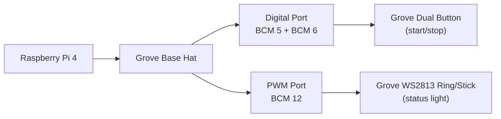

# Grove Expansion Plan for Touch TimeLapse

This plan covers integration of:

- **Grove Dual Button** (start/stop trigger)
- **Grove WS2813 status light** using either:
  - RGB LED Stick (10 LEDs), or
  - RGB LED Ring (20 LEDs)

Target platform: **Raspberry Pi 4 + Grove Base Hat + 3.5" touchscreen**.

---

## 1) Hardware wiring baseline

## Recommended initial wiring (safe defaults)

- **Grove Dual Button** → Digital port exposing **BCM 5 + BCM 6**
- **Grove WS2813 Ring/Stick** → PWM port signal on **BCM 12**

### Visual wiring chart (quick view)



### Port mapping cheat sheet

| Module | Connect to on Grove Base Hat | Signal mapping | App role |
|---|---|---|---|
| Grove Dual Button | A digital socket wired to **BCM 5 + BCM 6** | `button1=BCM5`, `button2=BCM6` | Start/Stop trigger (`button1` by default) |
| Grove WS2813 Ring/Stick | PWM socket wired to **BCM 12** | `pin=BCM12` | Status color + optional capture flash |

> Tip: If your hat revision uses different labels, keep the app config aligned to the **BCM pin mapping** above. The software follows BCM values, not printed port names.

### Shield aerial map (all ports + exact connection marks)

Orientation (same as Seeed top view):

- **Top** = GPIO header
- **Right** = Analog side (Pi USB/Ethernet edge is to the right of the board)

```text
TOP (GPIO HEADER)
┌─────────────────────────────────────────────────────────────────────────────┐
│ [ PWM ] [ D5 ] [ D16 ] [ D18 ] [ A0 ] [ A2 ]                              │
│  BCM12/13  BCM5/6                                                          │
│  LED ⇩     BUTTON ⇩                                                        │
│  Plug WS2813 here                                                          │
│             Plug Dual Button here                                          │
│                                                                             │
│ [UART ] [ D22] [ D24] [ D26] [ A4 ] [ A6 ]                                │
│ 14/15                                                                       │
│                                                                             │
│ [I2C-1] [I2C-2] [I2C-3] [ SWD + GPIO 9/10/11 ]                            │
└─────────────────────────────────────────────────────────────────────────────┘
BOTTOM (audio/USB side)
```

### Plug points (short version)

- **Dual Button** → socket **D5** (silk shows BCM **5/6**)
- **WS2813 LED (ring/stick)** → socket **PWM** (silk shows BCM **12/13**)

### Port groups on the hat (official naming)

- **PWM**: 1 socket → BCM12/13
- **UART (RPISER)**: 1 socket → BCM14/15
- **Digital**: 6 sockets → `D5`, `D16`, `D18`, `D22`, `D24`, `D26`
- **Analog**: 4 sockets → `A0`, `A2`, `A4`, `A6`
- **I2C**: 3 sockets (shared bus)
- **SWD**: programming header + free GPIO 9/10/11 area

### Exactly where to connect for this project

1. **Grove Dual Button (start/stop)** → digital socket labeled **D5** (BCM5/6 pair).
2. **Grove WS2813 Ring/Stick (status light)** → **PWM** socket labeled **BCM12/13**.

### Visual reference (official Seeed top view)

- Seeed product page: https://www.seeedstudio.com/Grove-Base-Hat-for-Raspberry-Pi.html
- Seeed wiki pin-out overview image: https://files.seeedstudio.com/wiki/Grove_Base_Hat_for_Raspberry_Pi/img/pin-out/overview.jpg

> Important: If silk labels and physical position ever seem inconsistent across board revisions, trust the **printed pin labels beside each socket**.

Notes:

- Grove Base Hat is 3.3V logic; use Grove-native modules only.
- WS2813 module type (ring vs stick) is selected in config via `grove_light.pixel_count`:
  - Stick = 10
  - Ring = 20

---

## 2) UX behavior (target)

- **Button 1** toggles capture:
  - idle/stopped → start
  - capturing → stop
- **Button 2** reserved for future action (session mark / menu / shutdown)

- WS2813 status color map:
  - idle: blue
  - capturing: green
  - stopped: amber
  - error: red
  - optional white flash on each successful capture

---

## 3) Software rollout phases

### Phase A (implemented in this branch)

- Add optional hardware adapters:
  - `grove_dual_button.py`
  - `grove_status_light.py`
- Add config sections:
  - `grove_button`
  - `grove_light`
- Integrate into `timelapse_touch.py` and `capture_engine.py` with graceful no-hardware fallback.
- Add automated tests for config + adapters.

### Phase B (next)

- Add settings UI controls for Grove button/light toggles and pin selection.
- Add in-app diagnostics panel:
  - show detected pins/devices
  - button press test mode
  - LED color test mode

### Phase C (field hardening)

- Long-run stress tests (8h+ captures).
- Touchscreen + GPIO coexistence verification across boot/autostart.
- Improve error surfaces and recovery prompts in UI.

---

## 4) Validation checklist on Pi

1. Start app without hardware attached: app should run normally.
2. Attach dual button only: pressing button1 toggles start/stop.
3. Attach LED stick/ring only: state colors update and capture flash works.
4. Attach both: ensure no missed button events during capture.
5. Reboot and run via desktop shortcut/autostart.

---

## 5) Config template

```yaml
grove_button:
  enabled: true
  pin_button1: 5
  pin_button2: 6
  debounce_ms: 250
  start_stop_button: button1

grove_light:
  enabled: true
  pin: 12
  pixel_count: 10  # use 20 for ring
  brightness: 48
  capture_flash: true
```

---

## 6) Ring vs Stick decision guide

- **Stick (10)**: compact, lower power, good for simple status.
- **Ring (20)**: better visibility, clearer animation at a distance.

Recommendation: start with **Stick (10)** for lower load, then test Ring (20) and compare visibility in your real shooting setup.
