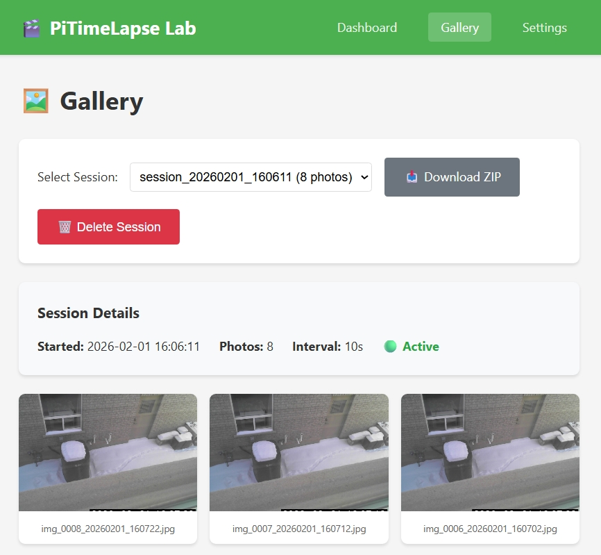

# 🎬 PiTimeLapse Lab

A beginner-friendly time-lapse studio that works on **Windows**, **macOS**, **Linux**, and **Raspberry Pi**! 📸

Capture photos using USB webcams, built-in laptop cameras, or Raspberry Pi cameras. Save them with timestamps and control everything through a **web browser** or a **touchscreen GUI**.

**Perfect for:**

- 🌅 Capturing sunsets and sunrises
- 🌱 Watching plants grow
- ☁️ Recording cloud movements
- 🏗️ Documenting projects
- 📚 Learning Python and Raspberry Pi!

---

## 📦 What's Inside

This repository contains **two complete time-lapse applications** and a set of **hands-on labs** for learning touchscreen development:

| Folder | What it is | Best for |
|--------|-----------|----------|
| [**01-WebApp-TimeLapse**](01-WebApp-TimeLapse/) | 🌐 Web-based time-lapse app with Flask | Any platform — control from your phone or computer |
| [**03-DSI-Touch-TimeLapse**](03-DSI-Touch-TimeLapse/) | 👆 Native DSI touchscreen app (Pygame) | Raspberry Pi kiosk-style capture with Freenove-style 7" displays |
| [**labs**](labs/) | 🧪 Hands-on LCD & touchscreen demos | Learning Raspberry Pi display programming |

> ⚠️ **Scenario 02 (SPI touch) is archived.** Use Scenario 03 for current touchscreen builds.

Need help choosing quickly? Start with [**SCENARIOS.md**](SCENARIOS.md) and [**GETTING_STARTED.md**](GETTING_STARTED.md).

---

## 🎯 Which Scenario Should I Use?

| Feature | 01 — WebApp TimeLapse | 03 — DSI Touch TimeLapse |
|---|---|---|
| **Interface** | Web browser (Flask) | Native touchscreen GUI (Pygame) |
| **Platform** | ✅ Windows, macOS, Linux, Raspberry Pi | 🍓 Raspberry Pi + DSI touchscreen (Freenove-style 7") |
| **Control** | Remote — from any device on the network | On-device — tap the screen directly |
| **Camera** | USB webcam, built-in camera, Pi Camera | USB webcam, Pi Camera |
| **Best for** | Remote monitoring, multi-device access | Standalone field capture, kiosk setups |
| **Complexity** | Beginner-friendly with extensive docs | Intermediate — hardware setup required |

> 💡 **Not sure?** Start with **Scenario 01** — it works on any computer and doesn't require special hardware.
>
> 🔎 For a fast chooser and setup flow, use [**SCENARIOS.md**](SCENARIOS.md).

---

## 📷 Screenshots

### Scenario 01 — WebApp TimeLapse

| Dashboard | Gallery | Settings |
|-----------|---------|----------|
|  |  |  |

---

## 🚀 Quick Start

### Scenario 01 — WebApp TimeLapse (Recommended)

```bash
git clone https://github.com/elbruno/Raspberry-Pi-TimeLapse-Studio.git
cd Raspberry-Pi-TimeLapse-Studio/01-WebApp-TimeLapse
pip install -r requirements.txt
python main.py validate         # Check your setup
python main.py                  # Open http://localhost:8000
```

> 💡 **Virtual environment optional.** On a dedicated Raspberry Pi you can install packages globally. On a shared/dev machine, use `python3 -m venv venv && source venv/bin/activate` first (Windows: `venv\Scripts\activate`).
>
> ⚠️ **PEP 668 error?** On newer Raspberry Pi OS, pip may refuse to install globally. Add `--break-system-packages` to the pip command — this is safe on a dedicated Pi.

📖 Full instructions → [**01-WebApp-TimeLapse/README.md**](01-WebApp-TimeLapse/README.md)

### Scenario 03 — DSI Touch TimeLapse (Raspberry Pi + Freenove DSI)

```bash
git clone https://github.com/elbruno/Raspberry-Pi-TimeLapse-Studio.git
cd Raspberry-Pi-TimeLapse-Studio/03-DSI-Touch-TimeLapse
bash install.sh --all
python timelapse_touch.py --fullscreen
```

> 💡 This is the primary touchscreen application for Raspberry Pi with DSI displays.
>
> ✅ Starting from a fresh SD card? Use the **touch cleanup profile** first, then install Scenario 03. Do **not** install any LCD driver package for the Freenove DSI panel.

📖 Full instructions → [**03-DSI-Touch-TimeLapse/README.md**](03-DSI-Touch-TimeLapse/README.md)

Need hardware wiring guidance first? Use [**GETTING_STARTED.md**](GETTING_STARTED.md) to jump to the right path.

---

## 🔧 Raspberry Pi Setup & Space Optimization

Just got a fresh Raspberry Pi and running low on disk space? The default Pi OS install takes ~5.3 GB, leaving only ~1.2 GB on an 8 GB card. Before installing either scenario, **free up space** by removing desktop bloat, unused packages, and caches.

### Quick Links

| I need to... | Go to... |
|-------------|----------|
| 🧭 **Choose web vs touch cleanup profile** | [Cleanup Profiles](99-InitRPi/CLEANUP_PROFILES.md) |
| 📖 **Start in 99-InitRPi** | [99-InitRPi README](99-InitRPi/README.md) |
| 📖 **Understand the cleanup plan** | [Cleanup Plan](99-InitRPi/Raspberry-Pi-TimeLapse-Studio-cleanup-plan.md) |
| 🔗 **Copy-paste SSH commands** | [SSH Commands Guide](99-InitRPi/rpi-cleanup-ssh-commands.md) ⬅️ **Start here!** |
| 🔐 **Enable internal-device auto-root defaults** | [enable-device-elevation.sh](99-InitRPi/enable-device-elevation.sh) |
| 📜 **Run the automated script** | [rpi-timelapse-cleanup.sh](99-InitRPi/rpi-timelapse-cleanup.sh) |

### Two cleanup profiles

- **Web profile** → Removes desktop/X11 for headless setups (works with Scenario 01 — WebApp)
- **Touch profile** → Keeps desktop/X11 for touchscreen UI (works with Scenario 03 — DSI Touch)

Typical savings: **500 MB – 1.5 GB** depending on profile.

For trusted/internal devices, the first-use flow can also enable
**passwordless sudo + automatic root shells** so day-to-day operation no longer
requires typing `sudo` repeatedly. See the SSH guide and
`99-InitRPi/enable-device-elevation.sh`.

---

## 🎓 New to Programming? Start Here

This project is designed for **beginners**! If you're new to programming or Raspberry Pi:

1. **Start simple**: Try `simple.py` in Scenario 01 — it's just ~80 lines of code!
2. **Learn the concepts**: Check out [Python Basics](01-WebApp-TimeLapse/docs/02_python_basics_used.md)
3. **Don't worry about mistakes**: They're the best way to learn!

<details>
<summary><strong>📖 Beginner's Glossary - Click to expand!</strong></summary>

| Term | What it means |
|------|--------------|
| **Repository (repo)** | A folder containing all the project files, tracked by Git |
| **Clone** | Download a copy of a repository to your computer |
| **Terminal/Command Line** | A text interface to type commands (like PowerShell or Bash) |
| **Virtual Environment (venv)** | An optional private space for this project's Python packages — recommended on shared machines, not needed on a dedicated Raspberry Pi |
| **pip** | Python's package installer - downloads and installs Python libraries |
| **requirements.txt** | A list of Python packages this project needs |
| **Port** | A number that identifies where a program "listens" for connections (like 8000) |
| **localhost** | Your own computer - used to access web apps running on your machine |
| **Camera index** | A number identifying which camera to use (0 = first camera, 1 = second, etc.) |
| **OpenCV** | A popular library for working with cameras and images |
| **Flask** | A simple framework for building web applications in Python |
| **Pygame** | A library for making graphical applications and games in Python |
| **Framebuffer** | A low-level way to draw directly to a screen without a desktop environment |

</details>

---

## 📖 Documentation

### Scenario 01 — WebApp TimeLapse

| I want to... | Go to... |
|--------------|----------|
| 🎯 **Start learning (beginner)** | [Simple Script Guide](01-WebApp-TimeLapse/docs/10_simple_script_guide.md) ⬅️ Start here! |
| 🔧 **Set up from scratch** | [Installation Guide](01-WebApp-TimeLapse/docs/06_installation_guide.md) |
| ⚙️ **Configure settings** | [Configuration Guide](01-WebApp-TimeLapse/docs/07_configuration_guide.md) |
| 🐛 **Fix a problem** | [Troubleshooting](01-WebApp-TimeLapse/docs/08_troubleshooting.md) |
| 📡 **Use the API** | [CLI & API Reference](01-WebApp-TimeLapse/docs/09_cli_api_reference.md) |
| 📚 **Understand the code** | [Project Overview](01-WebApp-TimeLapse/docs/01_project_overview.md) |

### Scenario 03 — DSI Touch TimeLapse

| I want to... | Go to... |
|--------------|----------|
| 🧩 **Set up the DSI touchscreen scenario** | [Scenario 03 README](03-DSI-Touch-TimeLapse/README.md) |
| 💽 **Provision a brand-new SD card for Scenario 03** | [Scenario 03 User Manual](03-DSI-Touch-TimeLapse/USER_MANUAL.md) |
| 🔌 **Wire Grove shield/buttons/LED for Scenario 03** | [Hardware Assembly](03-DSI-Touch-TimeLapse/HARDWARE_ASSEMBLY.md) |
| 📖 **Understand full app behavior/features** | [Scenario 03 User Manual](03-DSI-Touch-TimeLapse/USER_MANUAL.md) |

---

## 🔒 Safety & Privacy

- ⚠️ Only record where you have permission
- 🔐 Secure your Pi (change default password!)
- 🌐 Don't expose to the internet without protection

---

## 🤝 Contributing

1. Fork the repository
2. Create a feature branch: `git checkout -b my-new-feature`
3. Make your changes and run tests: `pytest`
4. Submit a Pull Request

---

## 📄 License

MIT License - see [LICENSE](LICENSE) file.

---

Made with ❤️ for makers, learners, and time-lapse enthusiasts!

**Questions?** Open an issue · **Found a bug?** Report it! · **Built something cool?** Share it!
